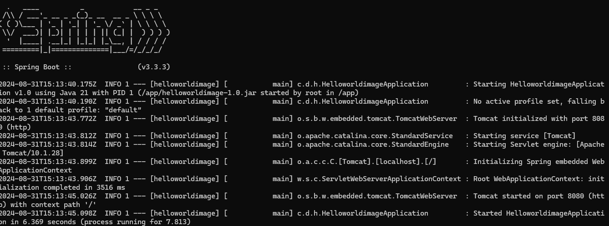

Spring-Boot Hello World Project  to Create a docker image

create a docker image for this helloworldimage project use below command

=> docker build -t imageName:tag .

For Example 

=> docker build -t hello-world:1.0 .

Docker image created successfully then create container and run base on

docker-compose.yml file or use below command

=> docker run -p 8080:8080 hello-world

use below endpoint to check hello world API response

http://localhost:8080/message